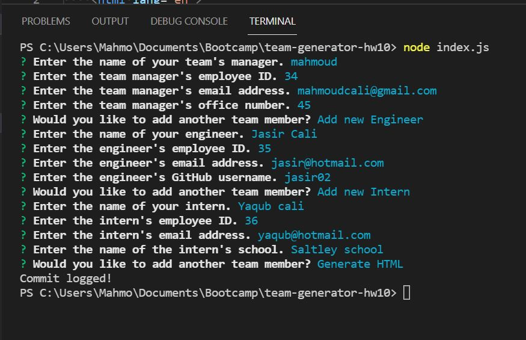
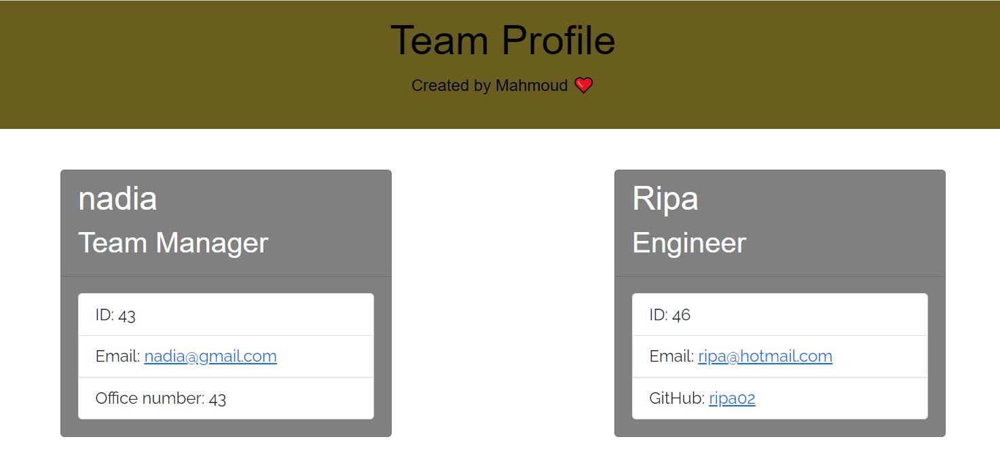

# random-team-generator-hw10 
# Description
A node.js team profile generator that allows you to generate a HTML website with team data shown in cards.
# Usage
Go to the **./index.js file** and run **node index.js** in the terminal,
after you run that, you will be promted with a series of question that you will need to answer
# Screenshots
### Click on the image below to see a video demonstrating how the application work.

# Deployed application screenshot

# Credits
Bootsrap: https://getbootstrap.com/

Npm Documention: https://docs.npmjs.com/

https://drive.google.com/file/d/1Y_TJ_TQbjFeRc3BUzXB2Wa-5fsJ61uLu/view?usp=sharing

